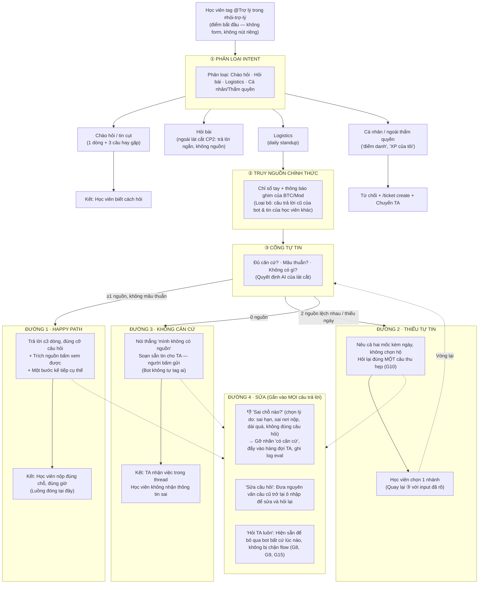

# Sơ đồ luồng — Từ tin nhắn đến điểm kết thúc

> **Trợ lý Discord — lát cắt `daily standup`**  
> CP2 · Luồng hoạt động | Mức prototype: MOCK  
> Nhóm `K4-3B-E402-C2_Team5changlinhngulam` · Track B1

Một tin nhắn tag bot đi qua ba cửa: **Phân loại intent** → **Truy nguồn chính thức** → **Cổng tự tin**.  
Cổng tự tin là chỗ duy nhất quyết định bot tự trả lời hay chuyển người. Đường 4 (sửa) gắn vào mọi câu trả lời.

---

## 📊 Sơ đồ luồng (Flowchart)

---

## 🎨 Trú giải màu sắc các đường đi

- 🟩 **Đường 1 · Happy path**: Trả lời tự tin, kèm nguồn chính thức và hành động kế tiếp.
- 🟨 **Đường 2 · Thiếu tự tin**: Mâu thuẫn nguồn hoặc thông tin không rõ ràng, hỏi lại 1 câu thu hẹp phạm vi.
- 🟥 **Đường 3 · Không căn cứ / Ngoài thẩm quyền**: Dừng lại, không suy đoán, chuẩn bị nháp tin chuyển TA hoặc chỉ dẫn lệnh `/ticket create`.
- 🟪 **Đường 4 · Sửa**: Tích hợp dưới mọi output, giúp học viên phản hồi, sửa câu hỏi hoặc chuyển ngay sang TA.

---

📌 *Ghi chú: Bản mẫu CP2 không gọi AI thật, không khóa API, không sử dụng dữ liệu cá nhân. Nguồn hiển thị là fixture dựng từ các tin nhắn ẩn danh trong `discord-pack`.*

